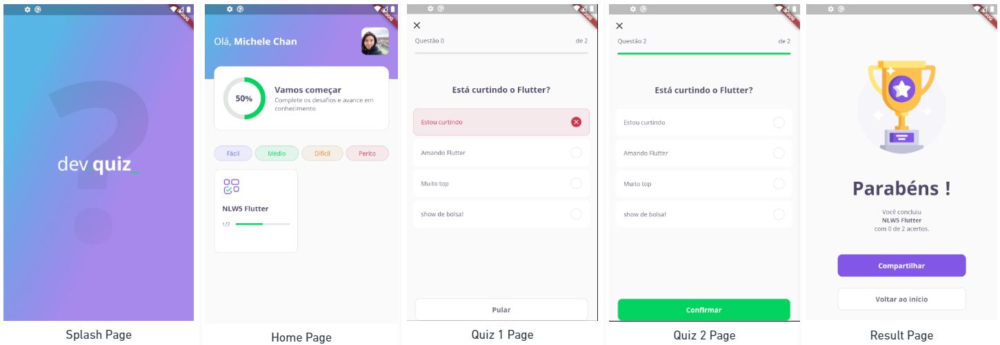

# DevQuiz

<p align="center">
    Aplicativo desenvolvido durante a Next Level Week 05 🚀
</p>

## 🔥 Preview
<p align="center">
  
</p>

## 🔗 Links

- [Roteiro](https://www.notion.so/Trilha-Flutter-a306b8d8751b4f76a7a1fc8f29db6d65)
- [Projeto no Figma](https://www.figma.com/file/oee9kcqSdTnFoA6Q89qxGg/DevQuiz-(Copy)?node-id=0%3A1)

## ⚡ Tecnologias

Esse projeto foi desenvolvido com as seguintes tecnologias:

- [Flutter](https://flutter.dev/)
- [Dart](https://dart.dev/)

## ⚒️ Extensões VSCode

- Awesome Flutter Snippets
- Dart
- Dart Data Class Generator
- Error lens
- Flutter
- Material Icon Theme

## 🚀 Instalação
```
# Clone este repositório
$ git clone https://github.com/michelewtc/devquiz-flutter-nlw5

# Acesse a pasta do projeto
$ cd devquiz

# Instale as dependências
$ flutter pub get

# Rodar o aplicativo
$ flutter run
```
